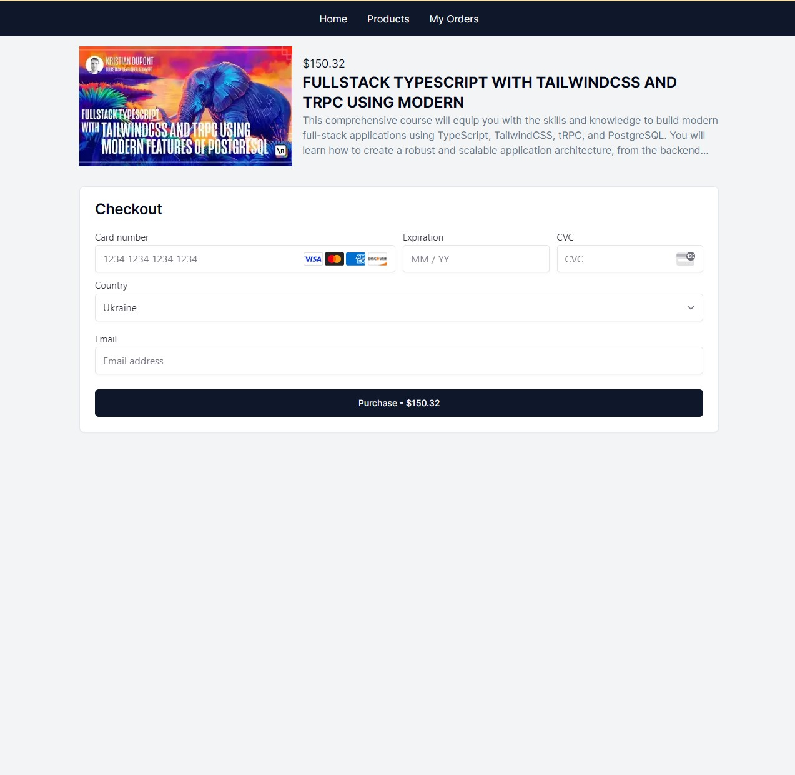
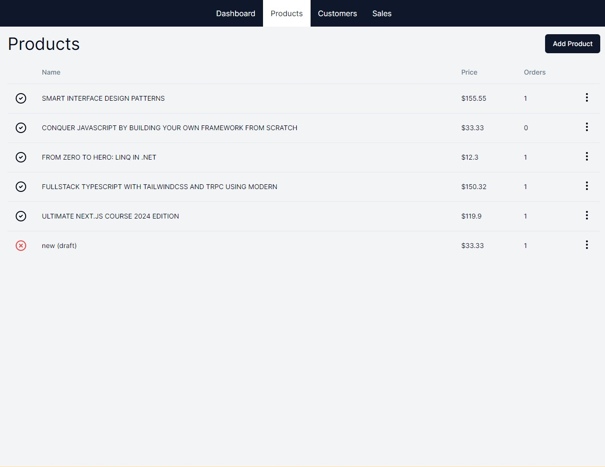
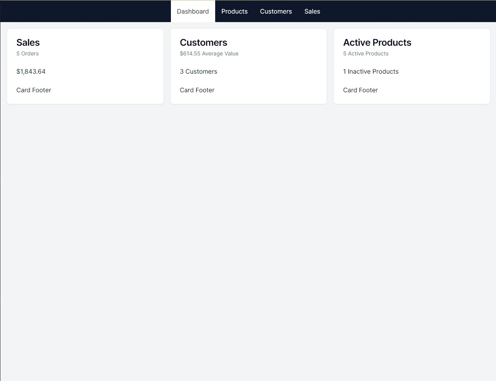

# E-commerce Shop

The next tools was used:

- [Resend](https://resend.com/) - for email
- [Stripe](https://stripe.com/) - for payment
- Nextjs, zod, tailwindcss, prisma, react-email

## Getting Started

First, run the development server:

```bash
npm run dev
```

Open [http://localhost:3000](http://localhost:3000) with your browser to see the result

#### For correct work webhook and success payment need run next command:

```bash
stripe listen --forward-to localhost:3000/webhooks/stripe
```

see more https://docs.stripe.com/webhooks/quickstart

##### For correct work all functionality pay attention on env variables, need to pass all KEYS.

## Admin panel

http://localhost:3000/admin

Login: _admin_\
Password: _admin_





